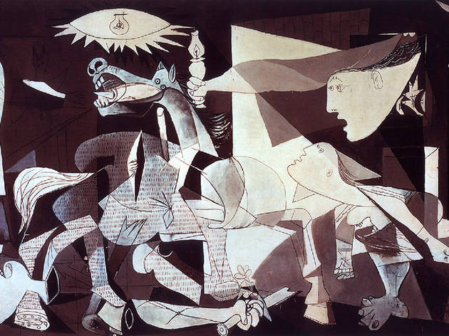
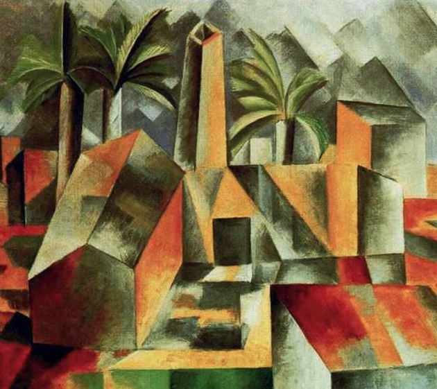
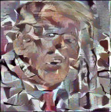
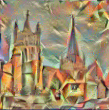

# Neural-Style-Transfer
Exploration and Implementation of style transfer techniques from the paper "A Neural Algorithm of Artistic Style" (arXiv:1508.06576)

## Aims

The goal of this project is simply to learn the techniques behind neural style transfer, and to create an easy-to-use interface that allows the user to experiment with different configurations. 

## Notes on implementation 

In the paper, it is mentioned that it is preferable to use the VGG-19 network with average pooling layers instead of max pooling layers. In addition to this, during the optimization we need a way to record the content and style losses at certain layers in the network. The most convenient way to do this was to create a new neural network that copied the convolutional layers of the VGG network, and which adds new loss layers at appropriate locations which track the style and content losses at every forward pass. 

After the new model was built, I kept a list of these new loss layers so that during an optimisation loop it would be easy to compute the loss with appropriate weightings. 

## Results

Here are some examples of the results. With the following style images:

You get the following generated images: 

## Todo
* tidy up interface (maybe select style and input images with command-line args)
